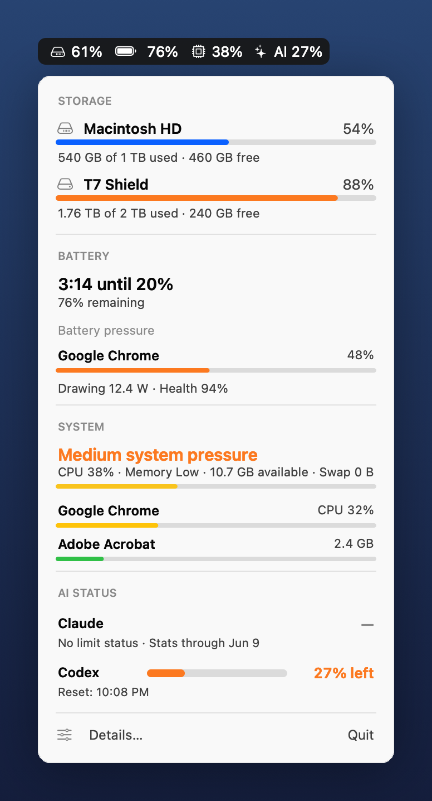

# Glancebar

**One configurable macOS menu bar item for machine and AI status — at a glance.**


<p align="center">
  
</p>

## Overview

Glancebar shows selected glance metrics in one compact menu bar item (`💾 61%  🔋 76%` by
default). Click it for one native popover with **Storage**, **Battery**, **System**, and
**AI Status** summaries: volume gauges, time until 20%, leading battery/system signals,
and Claude/Codex limit status. A
**Details…** window keeps fuller battery, system, and AI lists behind tabs without
crowding the popover. One item, one slot, **no dependencies, no daemons or helpers —
everything runs inside the one app you can quit — and no admin rights**.

It merges two earlier single-purpose apps — [Diskbar](https://github.com/todd866/diskbar)
and Voltbar (battery) — into one, so they stop competing for space next to the notch.

## Key Results

- **Configurable glance** — choose which menu-bar segments appear: storage, battery,
  system, and/or AI status.
- **Storage** — every volume (internal + external/NTFS) with Finder-accurate free space
  (purgeable counts as free); gauges turn orange past 85%, red past 95%.
- **Battery** — "3:14 until 20%" (not a bare percentage), plus battery pressure grouped by
  app/process with raw process names and plain-English context, live draw in watts, and
  battery health / cycle count.
- **System** — overall CPU, memory pressure, swap usage, and top CPU/memory apps grouped
  with the same raw-process-plus-context treatment; the popover shows the lead signals
  while Details keeps the longer lists.
- **AI status** — Codex's official remaining-quota percentage and reset time, read from
  its own session logs; exact per-day token totals; Claude's gauge fills in via an
  optional local status file. Usage history stays in Details.
- **Self-contained** — one binary, native popover UI, no runtime, no installer, no `sudo`.

## Build & Install

```bash
./build.sh                                  # → build/Glancebar.app (clang, ad-hoc signed)
./tests.sh                                  # run the pure-logic unit tests
cp -R build/Glancebar.app /Applications/    # install
open /Applications/Glancebar.app            # run
```

Start at login: **System Settings → General → Login Items → +** and add Glancebar.
Requires the Xcode Command Line Tools (`xcode-select --install`).

Headless readout: `Glancebar.app/Contents/MacOS/Glancebar --dump` prints disk, battery,
battery pressure, system pressure, and AI status to the terminal.

## How It Works

- **Disk** — `mountedVolumeURLs` (hidden volumes skipped), preferring the Finder-style
  "important usage" free-space figure.
- **Battery** — the IORegistry `AppleSmartBattery` entry (charge, charging state, raw mAh
  capacity, amperage, voltage, cycle count, smoothed time-to-empty). The menu bar updates
  instantly on plug/unplug via an `IOPSNotification`, otherwise every 15s.
- **Time until 20%** — macOS's smoothed minutes-to-empty scaled by `(charge − 20)/charge`,
  with an amperage-based fallback.
- **Battery pressure** — `top -l 2 -stats pid,command,power`, reading the second sample,
  grouped under the **outermost `.app` bundle in each executable path** where possible so
  helpers roll up under their parent app. Rows show the share of sampled app/process
  pressure, while preserving raw process names such as `syspolicyd`.
- **System pressure** — CPU is calculated from Mach processor tick deltas; memory uses
  Mach VM statistics plus `hw.memsize`; swap uses `vm.swapusage`. Top CPU and top memory
  apps come from `ps -axo pid=,pcpu=,rss=,comm=` and are grouped under parent apps where
  possible. If CPU and memory cannot be sampled, Glancebar reports the system state as
  unknown rather than treating missing data as low pressure.
- **AI status** — Codex's limit gauge comes straight from its own session logs: each
  turn in `~/.codex/sessions/**.jsonl` records OpenAI's official rate-limit state
  (`used_percent` and reset time for the 5-hour and weekly windows), and Glancebar shows
  the most constrained window that is still current. The same per-turn records carry
  exact token deltas, which is how today/7-day totals are computed (the sqlite thread
  store only keeps lifetime counters per thread, which can't be windowed honestly).
  Headline counts are **fresh tokens** (non-cached input + output); the raw total is
  ~16× larger because cached context is re-read every turn, and is shown alongside.
  Rollout files are append-only and read incrementally by byte offset on a background
  queue, so the steady-state cost is a handful of `stat` calls. Claude's local stats
  cache (`~/.claude/stats-cache.json`) has usage history but no quota data, so its gauge
  stays empty unless you provide `~/.glancebar/ai-status.json`:

  ```json
  {
    "Claude": { "remainingPercent": 42, "resetAt": "2026-06-10T19:00:00+10:00" }
  }
  ```

  That file overrides either provider's gauge. Glancebar reads local state only — never
  auth files — and sends no network requests.

The time estimator, battery-pressure grouping, process-stat grouping, and rollout-log
parsing are pure functions with unit tests (`./tests.sh`); the IORegistry, disk, `top`,
`ps`, and local AI state plumbing live in the app shell.

## Repository

```
glancebar/
├── Sources/pure.{h,m}   # pure, testable logic: time-to-20% + process grouping
├── Sources/main.m       # app shell: disk + battery readers, top sampling, popover UI
├── Tests/test_pure.m    # unit tests for the pure functions
├── tools/mockup.m       # renders docs/screenshot.png
├── build.sh  ·  tests.sh  ·  Info.plist
└── docs/screenshot.png
```

### A note on notched Macs

macOS adds new menu bar items at the left end of the status area, so on a notched MacBook
a fresh icon can land under the notch and look invisible. Free up space (System Settings →
Control Center → set icons you don't need to "Don't Show in Menu Bar") and it appears.
Glancebar being a single item — rather than two — makes this far less likely.

## Related

- **[Diskbar](https://github.com/todd866/diskbar)** — the disk-only predecessor, merged
  into Glancebar. (A battery-only predecessor, Voltbar, was also merged in.)

## Credits

Designed and built by **Claude Fable 5** (Anthropic), working from Ian Todd's brief and
direction — design, implementation, tests, the rendered screenshot, and this README.

## License

MIT — see [LICENSE](LICENSE).
